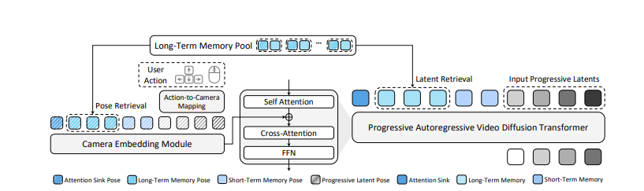
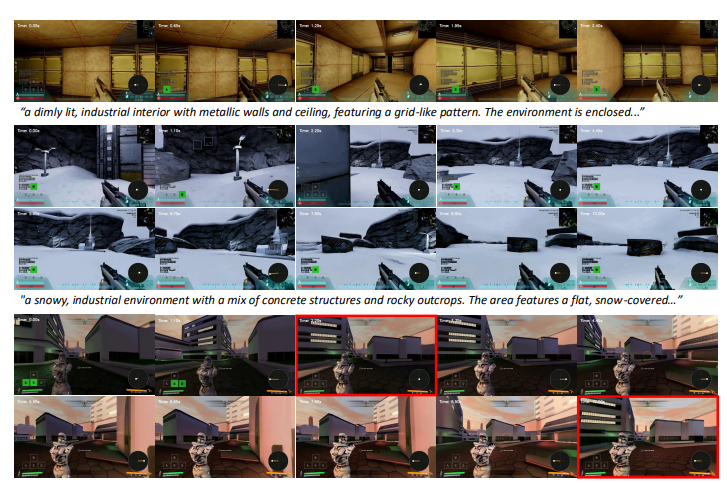
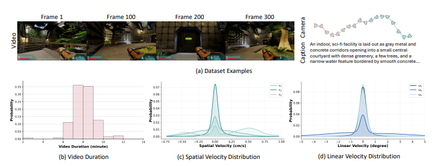

# 导读_WorldCam_Interactive_Autoregressive_3D_Gaming_Worlds
**论文标题**：WorldCam: Interactive Autoregressive 3D Gaming Worlds with Camera Pose as a Unifying Geometric Representation
**出处**：arXiv 2026 (cs.CV)
**使用大模型**：DeepSeek

## 1. 研究背景与动机
近年来，视频扩散Transformer（Video Diffusion Transformers）在交互式游戏世界建模领域取得了显著进展，能够让用户在生成的虚拟环境中进行长时间探索。然而，现有方法大多将用户操作（如键盘、鼠标输入）视为抽象控制信号，**忽略了动作与3D世界之间的本质几何耦合关系**。

在真实的游戏交互中，用户操作本质上是诱导相机在3D空间中发生相对运动，这些运动累积为相机的全局轨迹，最终决定了2D观测画面。此前的工作要么将动作视为抽象信号，要么仅在短视频（如16帧）上建模相机姿态，无法实现长时间的动作控制与稳定的3D空间一致性。因此，本文提出以**相机姿态作为统一几何表示**，来同时解决即时动作控制与长期3D一致性的难题。

---

## 2. 核心方法
本文的核心创新在于提出了一种基于**李代数（Lie Algebra）**的动作-相机映射机制，将用户动作直接转化为精确的6自由度（6-DoF）相机姿态，并以此作为生成模型的条件输入。

### 2.1 整体模型架构
WorldCam以视频Diffusion Transformer（DiT）为骨干，将用户动作转化为相机姿态，从而控制生成的3D游戏世界。其整体架构如下：

图2 WorldCam整体架构，包含动作-相机映射模块、相机嵌入模块、长期记忆池与渐进自回归视频扩散Transformer，通过相机姿态实现精确动作控制与3D空间一致性。

### 2.2 基于李代数的精确动作建模
为了解决传统线性近似在建模复杂相机运动时的漂移问题，本文引入了**李代数（Lie Algebra）**框架。相比于传统方法依赖于解耦的线性近似，李代数公式能够精确捕捉平移与旋转之间的耦合关系（即螺旋运动/Screw Motion）。

---

## 3. 主要结果
### 3.1 与SOTA模型的全面对比
本文将WorldCam与现有主流交互式游戏世界模型（The Matrix, Genie, GameCraft等）在三个核心指标上进行了对比：

表1 与现有交互式游戏世界模型的对比。WorldCam是目前唯一同时支持**动作可控性**、**3D一致性**和**长时程推理**的方法。

### 3.2 定性效果展示
在具体的交互任务（如前进、右转、左转）中，WorldCam生成的画面保持了极高的场景结构一致性，而其他模型容易出现场景错乱或漂移。

图1 WorldCam交互式3D游戏世界效果展示，在不同场景下均能保持精确动作控制与3D空间一致性。

---

## 4. 个人小结
### 亮点
1.  **表示学习的本质突破**：首次将相机姿态作为统一的几何表示，打通了用户动作与3D场景的物理连接，解决了长期以来动作控制与3D一致性脱节的问题。
2.  **高精度运动建模**：利用李代数精确拟合螺旋运动，相比传统线性方法大幅降低了轨迹误差，消除了长时交互中的漂移现象。
3.  **大规模数据与SOTA性能**：构建了包含3000分钟真实游戏数据的大规模数据集，并在各项指标上显著超越现有模型。

### 不足与展望
1.  **数据成本高**：模型依赖于大量真实游戏数据采集，数据构建成本较高。
2.  **交互复杂度**：目前主要支持第一人称射击游戏场景，未来可拓展至更复杂的开放世界RPG游戏场景。
3.  **实时性优化**：虽然支持长时生成，但在复杂场景下的推理速度仍有提升空间，以追求更高的实时交互体验。